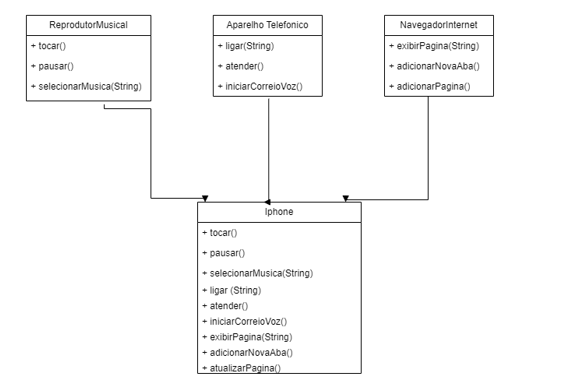

## POO - Desafio 

### Modelagem e Diagramação de um Componente iPhone

#### Desafio proposto 
Este projeto foi desenvolvido como parte do **Bootcamp Desenvolvimento Java com IA** oferecido pela [Digital Innovation One (DIO)](https://www.dio.me/). O desafio foi proposto por [Gleyson Sampaio](https://github.com/glysns), e consiste em modelar e diagramar a representação UML do componente iPhone, abrangendo suas funcionalidades como Reprodutor Musical, Aparelho Telefônico e Navegador na Internet.

Para detalhes completos do desafio, você pode consultar o [Projeto oficial](https://github.com/digitalinnovationone/trilha-java-basico/tree/main/desafios/poo).

### Implementação
Este repositório contém a minha implementação pessoal do desafio proposto, baseada no conhecimento adquirido até o momento no **Bootcamp Desenvolvimento Java com IA**. O objetivo foi aplicar os conceitos aprendidos até agora no curso, desenvolvendo o diagrama UML e implementando as classes e interfaces em Java para representar as funcionalidades do iPhone.

### Objetivo
O objetivo deste desafio é criar um diagrama UML que represente as funcionalidades descritas e implementar as classes e interfaces correspondentes em Java. As funcionalidades a serem modeladas incluem:

- **Reprodutor Musical**
  - `tocar()`
  - `pausar()`
  - `selecionarMusica(String musica)`

- **Aparelho Telefônico**
  - `ligar(String numero)`
  - `atender()`
  - `iniciarCorreioVoz()`

- **Navegador na Internet**
  - `exibirPagina(String url)`
  - `adicionarNovaAba()`
  - `atualizarPagina()`

### Diagrama UML

O diagrama UML que representa a modelagem do componente iPhone está disponível abaixo:

